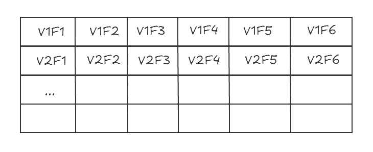
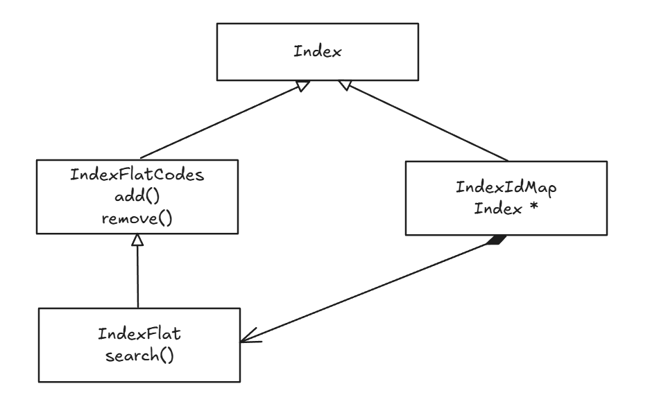

# Flat Index
Flat Index的实现简单，使用类似Vector容器平铺存储向量数据
其在内存中的分布如下


以Faiss 中Flat Index作为例子研究该索引的实现
Faiss中存在Index类， IndexFlatCodes类，IndexFlat类， IndexIDMap类，他们四者的关系如下

Index 作为抽象模板类，定义了需要实现哪些方法
IndexFlatCodes定义了add(), remove()方法
IndexFlat定义了Search()方法
IndexIDMap维护IndexID到Index实例的映射

## 初始化

初始化一个FlatIndex
`new faiss::IndexIDMap(new faiss::IndexFlat(dim, faiss_metric));`

关键结构体
```
struct Index {
    using component_t = float;
    using distance_t = float;

    int d;        ///< vector dimension
    idx_t ntotal; ///< total nb of indexed vectors
    bool verbose; ///< verbosity debug level

    /// set if the Index does not require training, or if training is
    /// done already
    bool is_trained;

    /// type of metric this index uses for search
    MetricType metric_type;
    float metric_arg; ///< argument of the metric type

    explicit Index(idx_t d = 0, MetricType metric = METRIC_L2)
            : d(d),
              ntotal(0),
              verbose(false),
              is_trained(true),
              metric_type(metric),
              metric_arg(0) {}
}

```
`is_trained`在FlatIndex中没有作用，主要用于IVFIndex(TODO)

```
/** Index that encodes all vectors as fixed-size codes (size code_size). Storage
 * is in the codes vector */
struct IndexFlatCodes : Index {
    size_t code_size;

    /// encoded dataset, size ntotal * code_size
    std::vector<uint8_t> codes; // 存放向量数据
}
```

关键函数包含在IndexIDMap中
```
/** Index that translates search results to ids */
template <typename IndexT>
struct IndexIDMapTemplate : IndexT {
    using component_t = typename IndexT::component_t;
    using distance_t = typename IndexT::distance_t;

    IndexT* index;   ///! the sub-index
    bool own_fields; ///! whether pointers are deleted in destructo
    std::vector<idx_t> id_map; // 维护外部ID到内部ID的映射，内部ID为向量数据在容器内的下标

    explicit IndexIDMapTemplate(IndexT* index);

    /// @param xids if non-null, ids to store for the vectors (size n)
    void add_with_ids(idx_t n, const component_t* x, const idx_t* xids)
            override;

    /// this will fail. Use add_with_ids
    void add(idx_t n, const component_t* x) override;

    void search(
            idx_t n,
            const component_t* x,
            idx_t k,
            distance_t* distances,
            idx_t* labels,
            const SearchParameters* params = nullptr) const override;
}
```
## add
```
template <typename IndexT>
void IndexIDMapTemplate<IndexT>::add_with_ids(
        idx_t n,
        const typename IndexT::component_t* x,
        const idx_t* xids) {
    index->add(n, x);
    for (idx_t i = 0; i < n; i++)
        id_map.push_back(xids[i]);
    this->ntotal = index->ntotal;
}

void IndexFlatCodes::add(idx_t n, const float* x) {
    FAISS_THROW_IF_NOT(is_trained);
    if (n == 0) {
        return;
    }
    codes.resize((ntotal + n) * code_size);
    sa_encode(n, x, codes.data() + (ntotal * code_size));
    ntotal += n;
}

void IndexFlat::sa_encode(idx_t n, const float* x, uint8_t* bytes) const {
    if (n > 0) {
        memcpy(bytes, x, sizeof(float) * d * n); // 直接将向量数据拷贝到容器内
    }
}
```

## search
根据不同距离计算方法 计算topk个最近邻向量
```
void IndexFlat::search(
        idx_t n,
        const float* x,
        idx_t k,
        float* distances,
        idx_t* labels,
        const SearchParameters* params) const {
    IDSelector* sel = params ? params->sel : nullptr;
    FAISS_THROW_IF_NOT(k > 0);

    // we see the distances and labels as heaps
    if (metric_type == METRIC_INNER_PRODUCT) {
        float_minheap_array_t res = {size_t(n), size_t(k), labels, distances};
        knn_inner_product(x, get_xb(), d, n, ntotal, &res, sel);
    } else if (metric_type == METRIC_L2) {
        float_maxheap_array_t res = {size_t(n), size_t(k), labels, distances};
        knn_L2sqr(x, get_xb(), d, n, ntotal, &res, nullptr, sel);
    } else if (is_similarity_metric(metric_type)) {
        float_minheap_array_t res = {size_t(n), size_t(k), labels, distances};
        knn_extra_metrics(
                x, get_xb(), d, n, ntotal, metric_type, metric_arg, &res);
    } else {
        FAISS_THROW_IF_NOT(!sel);
        float_maxheap_array_t res = {size_t(n), size_t(k), labels, distances};
        knn_extra_metrics(
                x, get_xb(), d, n, ntotal, metric_type, metric_arg, &res);
    }
}
```