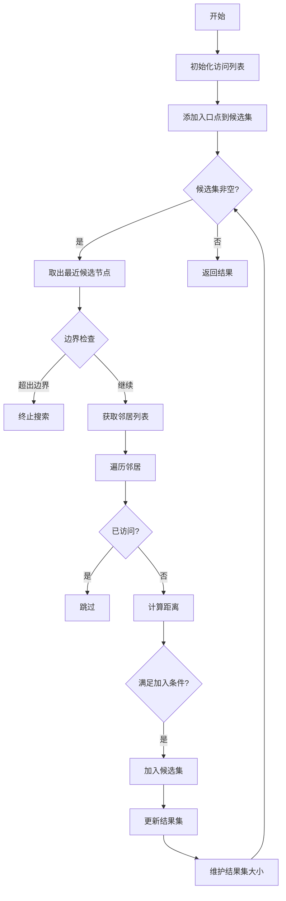

# HNSW Index
HNSW(Hierarchical Navigable Small World) 分层可导航小世界索引

算法原理
算法基本原理可以用多层跳表搜索 + 贪心来解释
先来解释分层：
eg: 有序链表查找key==11


初始化N层跳表，最顶层的跳跃步长最大，数据越到底层越密集。
查找key==11的步骤：
从最顶层开始查找，当找到的key大于目标key 或者 搜索到达链表尾部时，从开始节点向下层移动，重复该步骤直到找到目标key.

接下来解释可导航小世界：

查找给定向量的最邻近向量步骤：
1.每个向量都维护一个与自己最近邻的k个向量，形成一张图。
2.给定一个开始向量，遍历该点的所有近邻向量，找到与目标向量最近邻的向量，重复步骤2
3.当无法找到更加近邻的向量时，此时已经到达了局部最小值，此时就找到了目标向量最近邻的向量

综合上述两种算法
每个向量都维护k个与自己最相邻的节点，构成一张图，同时，维护多层次关系。越上层图越稀疏，越下层图越密集。


当需要查找最近邻向量时，从最上层开始节点出发，在每一层都找到局部最小值，找到后向下层查找，直到最底层。最近邻向量一定出现在最底层。


## 关键结构体成员含义

关键结构体：class HierarchicalNSW : public AlgorithmInterface<dist_t>
| 成员变量名 | 类型 | 含义 |
|--------------------------------------|--------------------------------------------|----------------------------------------------------------------------|
| MAX_LABEL_OPERATION_LOCKS | const tableint | 标签操作锁的最大数量（常量） |
| DELETE_MARK | const unsigned char | 删除标记的字节值（常量） |
| max_elements_ | size_t | 索引支持的最大元素数量 |
| cur_element_count | mutable std::atomic<size_t> | 当前索引中的元素数量（包括标记删除的元素？） |
| size_data_per_element_ | size_t | 每个元素的数据部分的大小（字节） |
| size_links_per_element_ | size_t | 每个元素的链接部分的总大小（字节） |
| num_deleted_ | mutable std::atomic<size_t> | 被标记删除的元素数量 |
| M_ | size_t | 非0层每个节点的最大连接数（M参数） |
| maxM_ | size_t | 非0层每个节点的最大连接数（同M_） |
| maxM0_ | size_t | 第0层每个节点的最大连接数 |
| ef_construction_ | size_t | 构建索引时的动态候选列表大小（efConstruction） |
| ef_ | size_t | 搜索时的动态候选列表大小（ef） |
| mult_ | double | 用于计算节点层数的乘数（指数分布参数） |
| revSize_ | double | 可能是某个值的倒数（如1.0/log(M_)）用于优化计算 |
| maxlevel_ | int | 当前索引中的最高层数（从0开始） |
| visited_list_pool_ | std::unique_ptr<VisitedListPool> | 访问列表池，用于搜索时记录访问过的节点 |
| label_op_locks_ | mutable std::vector<std::mutex> | 按标签值对元素操作进行加锁的互斥锁数组 |
| global | std::mutex | 全局互斥锁，保护整个索引的全局操作 |
| link_list_locks_ | std::vector<std::mutex> | 保护每个节点的链接列表（邻居列表）的互斥锁数组 |
| enterpoint_node_ | tableint | 进入点（入口节点）的内部ID |
| size_links_level0_ | size_t | 第0层链接列表的大小（字节） |
| offsetData_ | size_t | 在数据块中，元素向量数据的偏移量 |
| offsetLevel0_ | size_t | 在数据块中，第0层链接的偏移量 |
| label_offset_ | size_t | 在数据块中，标签（label）的偏移量 |
| data_level0_memory_ | char * | 指向存储第0层数据（向量数据和链接）的内存块的指针 |
| linkLists_ | char ** | 非0层的最近邻指针，存储其他层每个节点的索引信息(size | neighbours IDs[]) |
| element_levels_ | std::vector<int> | 每个元素的层级（最高层） |
| data_size_ | size_t | 向量数据的大小（字节）（每个元素的向量数据部分的大小） |
| fstdistfunc_ | DISTFUNC<dist_t> | 距离函数的函数指针 |
| dist_func_param_ | void * | 距离函数的附加参数 |
| label_lookup_lock | mutable std::mutex | 保护label_lookup_的互斥锁 |
| label_lookup_ | std::unordered_map<labeltype, tableint> | 外部标签到内部ID的映射 |
| level_generator_ | std::default_random_engine | 随机数生成器（用于生成节点层数） |
| update_probability_generator_ | std::default_random_engine | 随机数生成器（用于更新操作的概率决策） |
| metric_distance_computations | mutable std::atomic<long> | 距离计算次数的计数器（性能监控） |
| metric_hops | mutable std::atomic<long> | 搜索过程中访问节点数的计数器（跳数，性能监控） |
| allow_replace_deleted_ | bool | 是否允许在插入时替换被删除的元素 |
| deleted_elements_lock | std::mutex | 保护deleted_elements集合的互斥锁 |
| deleted_elements | std::unordered_set<tableint> | 被删除元素的内部ID集合（软删除） |

## 初始化

初始化的关键是明白向量数据是如何存储的

#### 第0层
全部的真实的向量数据都保存在第0层中
对于第0层数据，保存在data_level0_memory_所指向的内存中，向量数据以内部ID顺序排布，按照以下格式存储：

neighbours中保存了maxM0_个近邻向量的ID(内部ID)
那么对第0层而言，一个向量的存储开销为：
`4B + maxM0_ * 4B + dim * 每个维度的大小 + 4B`

非0层仅保留Neighbours ID的信息，maxM_控制保留的Neighbours数量， 不保留真实的向量数据
非0层的数据全部存放在`linkLists_`中，List下标对应改向量在第0层的下标。List中存放指向上层数据的指针
结构如下：

所以对于非0层的数据， 假设一条向量数据同时在N层中都存在，那么其对应的内存开销为：
`4B(linkLists_中指针的大小) + N * (4B + maxM_ * 4B)`

对应到构造函数中的代码：
```
    size_links_level0_  =  maxM0_  *  sizeof(tableint) +  sizeof(linklistsizeint); 
        // | 实际邻居数量 (linklistsizeint)(4Byte) | 邻居ID列表 (tableint[maxM0_]) |
        
    size_data_per_element_  =  size_links_level0_  +  data_size_  +  sizeof(labeltype);
        // | 邻居数组 | 向量数据大小 | header(4B)
    
    data_level0_memory_  = (char  *) malloc(max_elements_  *  size_data_per_element_); // 一次申请好
    linkLists_  = (char  **) malloc(sizeof(void  *) *  max_elements_); // 添加节点时动态申请非0层内存挂载指针到该list上
```


## 添加向量数据


结合代码：
```
    /*
    * Adds point. Updates the point if it is already in the index.
    * If replacement of deleted elements is enabled: replaces previously deleted point if any, updating it with new point
    */
    void addPoint(const void *data_point, labeltype label, bool replace_deleted = false) {
        if ((allow_replace_deleted_ == false) && (replace_deleted == true)) {
            throw std::runtime_error("Replacement of deleted elements is disabled in constructor");
        }

        // lock all operations with element by label
        std::unique_lock <std::mutex> lock_label(getLabelOpMutex(label)); // 确保同时只有一个线程操作该标签
        if (!replace_deleted) {
            addPoint(data_point, label, -1); // 禁用替换，正常append向量数据
            return;
        }
        // check if there is vacant place
        tableint internal_id_replaced;
        std::unique_lock <std::mutex> lock_deleted_elements(deleted_elements_lock);
        bool is_vacant_place = !deleted_elements.empty();
        if (is_vacant_place) {
            // 有可用位置，获取替换的内部ID
            internal_id_replaced = *deleted_elements.begin();
            deleted_elements.erase(internal_id_replaced);
        }
        lock_deleted_elements.unlock();

        // if there is no vacant place then add or update point
        // else add point to vacant place
        if (!is_vacant_place) {
            // 没有位置替换，正常append向量数据
            addPoint(data_point, label, -1);
        } else {
            // 替换向量数据和ID 
            // we assume that there are no concurrent operations on deleted element
            labeltype label_replaced = getExternalLabel(internal_id_replaced);
            setExternalLabel(internal_id_replaced, label);

            std::unique_lock <std::mutex> lock_table(label_lookup_lock);
            label_lookup_.erase(label_replaced);
            label_lookup_[label] = internal_id_replaced;
            lock_table.unlock();

            unmarkDeletedInternal(internal_id_replaced);
            updatePoint(data_point, internal_id_replaced, 1.0);
        }
    }
```

添加向量数据代码分析：

结合代码：
```
tableint addPoint(const void *data_point, labeltype label, int level){
    ...
    
    std::unique_lock <std::mutex> lock_table(label_lookup_lock);
    auto search = label_lookup_.find(label);
    if (search != label_lookup_.end()) {
        // 查找相同LabelId的数据 尝试更新 （外部标签相同就更新？）
        tableint existingInternalId = search->second;
        if (allow_replace_deleted_) {
            if (isMarkedDeleted(existingInternalId)) {
                throw std::runtime_error("Can't use addPoint to update deleted elements if replacement of deleted elements is enabled.");
            }
        }
        lock_table.unlock();

        // 如果已经被标记删除则去除标记删除的标记
        if (isMarkedDeleted(existingInternalId)) {
            unmarkDeletedInternal(existingInternalId);
        }
        // 更新向量数据
        updatePoint(data_point, existingInternalId, 1.0);

        // 返回内部ID
        return existingInternalId;
    }

    ...
    // 初始化向量标记
    tableint cur_c = 0; //内部ID
    cur_c = cur_element_count;
    cur_element_count++;
    label_lookup_[label] = cur_c;

    // 通过概率函数获得函数应该所在的层
    int curlevel = getRandomLevel(mult_); TODO:解析
    if (level > 0)
        curlevel = level; // 若参数指定层级使用指定层级插入

    element_levels_[cur_c] = curlevel; // 下标即内部ID
    tableint currObj = enterpoint_node_;
    tableint enterpoint_copy = enterpoint_node_;

    ...
    // 第0层数据清零
    memset(data_level0_memory_ + cur_c * size_data_per_element_ + offsetLevel0_, 0, size_data_per_element_);

    // Initialisation of the data and label
    memcpy(getExternalLabeLp(cur_c), &label, sizeof(labeltype));
    memcpy(getDataByInternalId(cur_c), data_point, data_size_); // 向第0层写入向量数据

    if (curlevel) {
        linkLists_[cur_c] = (char *) malloc(size_links_per_element_ * curlevel + 1);
        memset(linkLists_[cur_c], 0, size_links_per_element_ * curlevel + 1); // 初始化非0层数据
    }

    ...
    if ((signed)currObj != -1) {
        // TODO: 展开分析多层搜索逻辑将新增的节点与原始图进行连接，并产生邻近连接数组
    } else {
        // 如果是第一个插入的向量数据则不做任何处理
        enterpoint_node_ = 0;
        maxlevel_ = curlevel;
    }

    // 如果新点层次高于当前最大层次 当前点作为新的入口点，并更新最大层级
    if (curlevel > maxlevelcopy) {
        enterpoint_node_ = cur_c;
        maxlevel_ = curlevel;
    }

    return cur_c; // 返回内部ID
}
```

## 查询KNN邻近向量

核心思想就是在每层中找到局部最优（贪心），然后逐层遍历直到找到最终k个结果
直接上代码：
```
std::priority_queue<std::pair<dist_t, labeltype >>
    searchKnn(const void *query_data, size_t k, BaseFilterFunctor* isIdAllowed = nullptr) const {
        ...
        // 从最高层入口开始
        tableint currObj = enterpoint_node_;
        dist_t curdist = fstdistfunc_(query_data, getDataByInternalId(enterpoint_node_), dist_func_param_);

        // 逐层下降贪心搜索 先找到最近邻
        for (int level = maxlevel_; level > 0; level--) {
            bool changed = true;
            while (changed) {
                changed = false;
                unsigned int *data;

                // 获取当前节点的邻居
                data = (unsigned int *) get_linklist(currObj, level);
                int size = getListCount(data);
                metric_hops++;
                metric_distance_computations+=size;

                // 遍历邻居
                tableint *datal = (tableint *) (data + 1);
                for (int i = 0; i < size; i++) {
                    tableint cand = datal[i];
                    if (cand < 0 || cand > max_elements_)
                        throw std::runtime_error("cand error");
                    // 计算距离
                    dist_t d = fstdistfunc_(query_data, getDataByInternalId(cand), dist_func_param_);

                    // 找到更近的点就更新局部最小值 如果没进入就说明已经到了最小的点
                    if (d < curdist) {
                        curdist = d;
                        currObj = cand;
                        changed = true;
                    }
                }
            }
        }

        ...
        // 根据最近邻的邻居找到knn
        std::priority_queue<std::pair<dist_t, tableint>, std::vector<std::pair<dist_t, tableint>>, CompareByFirst> top_candidates;
        top_candidates = searchBaseLayerST<false>(
        currObj, query_data, std::max(ef_, k), isIdAllowed); // 详细解析源码

        ...
        // 剪枝产生最终的结果
        while (top_candidates.size() > k) {
            top_candidates.pop();
        }
        // 转换内部ID为外部标签
        while (top_candidates.size() > 0) {
            std::pair<dist_t, tableint> rez = top_candidates.top();
            result.push(std::pair<dist_t, labeltype>(
                rez.first, 
                getExternalLabel(rez.second)
            ));
            top_candidates.pop();
        }
        return result;
    }
```

## getRandomLevel
构建的图决定了搜索的性能
插入新节点时调用`getRandomLevel`返回该节点的插入的层
```c
int getRandomLevel(double reverse_size) {
    // 1. 创建[0,1)区间的均匀分布
    std::uniform_real_distribution<double> distribution(0.0, 1.0);
    
    // 2. 将均匀分布转换成指数分布
    double r = -log(distribution(level_generator_)) * reverse_size;
    
    // 3. 取整返回层级
    return (int) r;
}
```
reserse_size由mult_控制 `mult_ = 1 / log(1.0 * M_);`
节点分布的概率分布为：
`P(L ≥ ℓ) = e^{-ℓ * λ}`
`λ = 1/reverse_size`
对应的概率分布图如下


不同`M_`值下的概率分布：
|层级 ℓ	| M_=16 (P≥ℓ) |	M_=32 (P≥ℓ)|	M_=64 (P≥ℓ)|
|--------------------------------------|--------------------------------------------|----------------------------------------------------------------------|--------------------------------------|
|0|	1.000|	1.000	|1.000|
|1| 0.0625|	0.0313|	0.0156|
|2|	0.0039|	0.0010|	0.0002|
|3|	0.0002|	3e-5|	3e-6|

## searchBaseLayerST详细解析源码
启发式图搜索算法，给定一个目标向量和EntryPoint，从EntryPoint开始找到距离给定向量距离最近的k个向量集合及其距离


```c
std::priority_queue<std::pair<dist_t, tableint>, std::vector<std::pair<dist_t, tableint>>, CompareByFirst>
    searchBaseLayer(tableint ep_id, const void *data_point, int layer) {
        // 初始化访问列表，存放已经访问的节点
        VisitedList *vl = visited_list_pool_->getFreeVisitedList();
        vl_type *visited_array = vl->mass;
        vl_type visited_array_tag = vl->curV;

        // 维护小根堆 存储最近的ef_construction_个点
        std::priority_queue<std::pair<dist_t, tableint>, std::vector<std::pair<dist_t, tableint>>, CompareByFirst> top_candidates;

        // 维护大根堆 候选集存储已经访问过的节点和距离
        std::priority_queue<std::pair<dist_t, tableint>, std::vector<std::pair<dist_t, tableint>>, CompareByFirst> candidateSet;

        dist_t lowerBound;
        if (!isMarkedDeleted(ep_id)) {
            // 入口点未被标记删除
            dist_t dist = fstdistfunc_(data_point, getDataByInternalId(ep_id), dist_func_param_);
            // 更新最小值
            top_candidates.emplace(dist, ep_id);
            lowerBound = dist;
            candidateSet.emplace(-dist, ep_id);
        } else {
            // 入口点已被标记删除
            lowerBound = std::numeric_limits<dist_t>::max();
            candidateSet.emplace(-lowerBound, ep_id);
        }
        visited_array[ep_id] = visited_array_tag; // 访问标记

        while (!candidateSet.empty()) {
            std::pair<dist_t, tableint> curr_el_pair = candidateSet.top();
            if ((-curr_el_pair.first) > lowerBound && top_candidates.size() == ef_construction_) {
                // 结果集已满 或者当前候选距离大于边界值
                break;
            }
            candidateSet.pop();
            // 去除最近的候选
            tableint curNodeNum = curr_el_pair.second;

            std::unique_lock <std::mutex> lock(link_list_locks_[curNodeNum]);

            int *data;  // = (int *)(linkList0_ + curNodeNum * size_links_per_element0_);
            if (layer == 0) {
                data = (int*)get_linklist0(curNodeNum);
            } else {
                data = (int*)get_linklist(curNodeNum, layer);
            }
            size_t size = getListCount((linklistsizeint*)data);
            tableint *datal = (tableint *) (data + 1); // 获得最近候选的邻居列表

            // 遍历邻居
            for (size_t j = 0; j < size; j++) {
                tableint candidate_id = *(datal + j);

                if (visited_array[candidate_id] == visited_array_tag) continue; // 已经访问过
                visited_array[candidate_id] = visited_array_tag;
                char *currObj1 = (getDataByInternalId(candidate_id));

                dist_t dist1 = fstdistfunc_(data_point, currObj1, dist_func_param_); // 计算距离
                if (top_candidates.size() < ef_construction_ || lowerBound > dist1) { 
                    // 距离比当前lowerBound更小则更新候选列表

                    candidateSet.emplace(-dist1, candidate_id); // 更新访问列表中的距离

                    if (!isMarkedDeleted(candidate_id))
                        top_candidates.emplace(dist1, candidate_id);  // 未被标记删除，加入小根堆

                    if (top_candidates.size() > ef_construction_)
                        top_candidates.pop();

                    if (!top_candidates.empty())
                        lowerBound = top_candidates.top().first; // 更新lowerBound
                }
            }
        }
        visited_list_pool_->releaseVisitedList(vl);

        return top_candidates;
    }
```
## TODO: 多层搜索逻辑将新增的节点与原始图进行连接，并产生邻近连接数组

# Site
https://www.pinecone.io/learn/series/faiss/hnsw/
